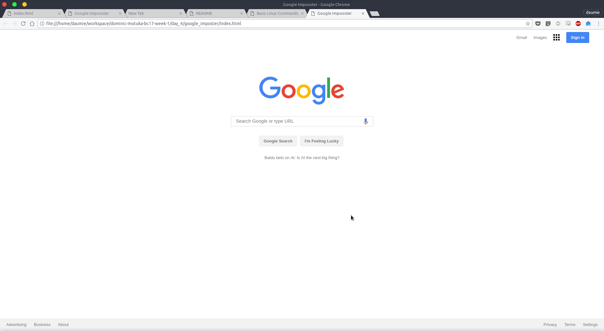

### A DOCUMENTATION TO ANDELA BOOTCAMP EXERCISES
---


#### Prerequisites
Before runnig the files on your system, ensure you have `python3` installed
You can install python on various platforms by following the various tutorisls at: [Install python](https://www.python.org/)

---

### Running the tests
The project makes use of [python unittest framework](https://docs.python.org/3/library/unittest.html) .A testcase is created by subclassing `unittest.TestCase` .The three individual tests are defined with methods whose names start with the letters *test*.
>Inorder to run the unit tests , move the files into the *tests* directory and
>if on *nix run `$ python -u test_filename.py`
> You shoud have **python3** installed and **unnitest**

**N/B**
 For files that require unit testing,follow *Running Unit tests* to perform specific tests for each file

---

#### DAY 1
[Day 1 proposed solution files](https://github.com/daumie/dominic-motuka-bc17-week-1/tree/master/day_1)
##### Asymptotic analysis to primeSieve.py
The time complexity of the steps in primeSieve()
For each prime number
*primes <= sqrt(n)*
We cross out at most *n/primes* so we get the operations
*n/2*+*n/3*+*n/5*+*...*


The sum of the reciprocals of the *primes* <= *n* equals asymptotically :
        ```O(log log n)```

---

### DAY 2

A list of exercises apportioned for the second day of the bootcamp(offsite)
[Day 2 proposed solutions files](https://github.com/daumie/dominic-motuka-bc17-week-1/tree/master/day_2) 

---

### DAY 3
The main highlight of work in day_3 is creating a simple commandline application that consumes a public API using HTTP client library
[Day 3 proposed solutions files](https://github.com/daumie/dominic-motuka-bc17-week-1/tree/master/day_3)

> The folder also contains A simple application to determine position of 
> International Space station


---

### DAY 4

[Day 4 proposed solutions](https://github.com/daumie/dominic-motuka-bc17-week-1/tree/master/day_4) 

##### Analysis of  Binary Search

Each comparison in binary search eliminates about half of the remaining items from consideration. 

---

| **Comparisons** | ** Items Left** |
|:--------------:|:--------------:|
|      *1*         |        `n/2`     |
|      *2*         |        `n/4`     |
|      *3*         |        `n/8`     |
|      *...*       |        `...`     |
|      *i*         |        `n/2**i`  |

---
When the list is split enough times, we end up with a list that has just one item.  Either that is the item we are looking for or it is not. The maximum
number of comparisons is logarithmic with respect to the number of items in the list. Therefore, the binary search is ```𝑂(log 𝑛)```

----

##### Google Page Imposter

An imposter google page created using html and css



---

### Hat tip

Sieve of eratosthenes photo courtesy of [wwwhomes](http://wwwhomes.uni-bielefeld.de/achim/prime_sieve.html)
The Andela logo , courtsey of [This is Andela](https://andela.com/blog/this-is-andela/)


#### License
This project is licensed under the [MIT License](https://opensource.org/licenses/MIT)

